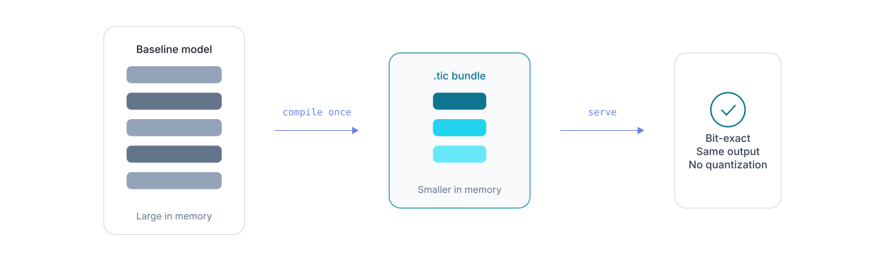

<!-- SPDX-License-Identifier: Apache-2.0 -->

<h1 align="center">
  <a href="https://isiro.ai">ISIRO Runtime</a>
</h1>

<h3 align="center">Lossless inference layer for self-hosted AI</h3>

<p align="center">Smaller weights · More KV cache · No quantization</p>

<p align="center">
  <a href="#quick-start">Quick start</a> •
  <a href="https://isiro.ai/models">Sample models</a> •
  <a href="benchmarks/README.md">Benchmarks</a> •
  <a href="https://isiro.ai/docs">Documentation</a>
</p>

<p align="center">
  <picture>
    <source media="(prefers-color-scheme: dark)" srcset="images/story-banner-dark.svg" />
    
  </picture>
</p>

Compile your model once into a lossless, compact [`.tic`](https://isiro.ai/docs/tic) bundle. Weights are bit-exact and are verified with a cryptographic hash manifest. Serve with ISIRO Runtime, which integrates your existing stack.

*Supported today: BF16 with vLLM on NVIDIA GPUs.*  
*More precisions, runtime targets, and platforms are in progress.*

## Quick start

```sh
# Install
curl -fsSL https://isiro.ai/install.sh | sh
```

More install options: [Installation](https://isiro.ai/docs/getting-started/install).

```sh
# Optional: download a model if needed (Linux/macOS)
python -m venv .venv
source .venv/bin/activate
pip install --upgrade huggingface_hub
hf download Qwen/Qwen2.5-7B-Instruct --local-dir Qwen2.5-7B-Instruct

# Compile to .tic bundle (requires [compiler access](https://isiro.ai/compiler))
isiro compile Qwen2.5-7B-Instruct --model-id Qwen/Qwen2.5-7B-Instruct -j 8

# Serve (vLLM supported today)
isiro serve Qwen2.5-7B-Instruct-TIC --target vllm
```

Chat after serve: [docs](https://isiro.ai/docs/getting-started/chat). Sample `.tic` models: [isiro.ai/models](https://isiro.ai/models) ([Hugging Face](https://huggingface.co/isiroai)).

## License

This repository does not include ISIRO engine source.

| Content | License |
| ------- | ------- |
| Docs, scripts, benchmarks, and images in this repository | [Apache-2.0](LICENSE) |
| ISIRO Runtime, Compiler, .tic format | [ISIRO EULA](https://isiro.ai/eula) |

ISIRO is a trademark of Isiro, Inc.

## Contributing

Docs and benchmarks welcome. See [CONTRIBUTING.md](CONTRIBUTING.md).

## Security

See [SECURITY.md](SECURITY.md).
